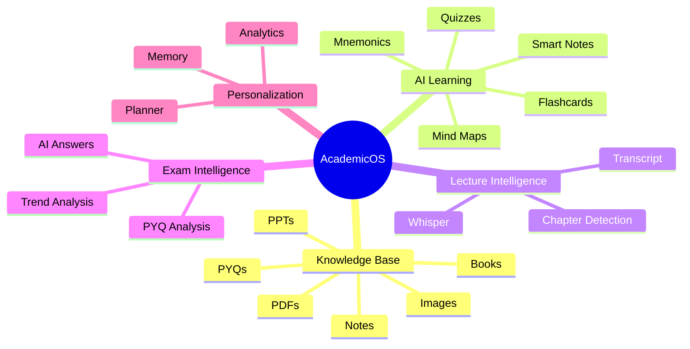
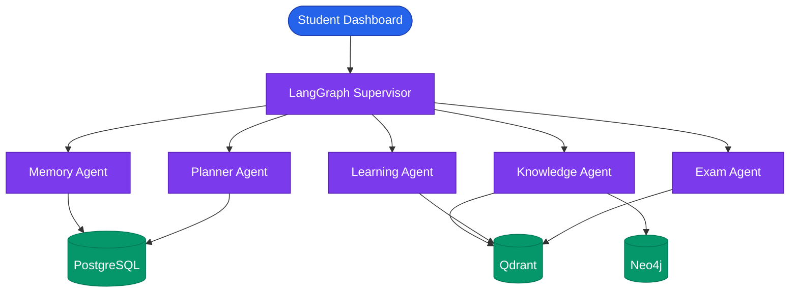
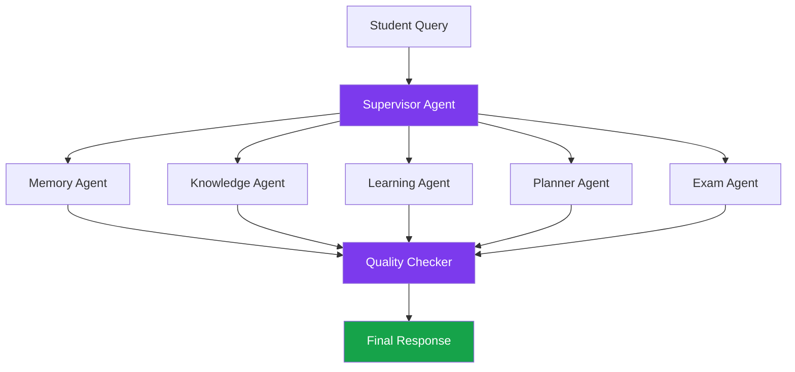
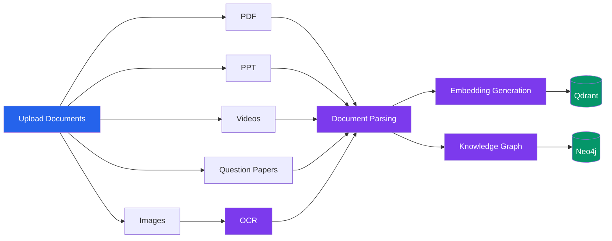
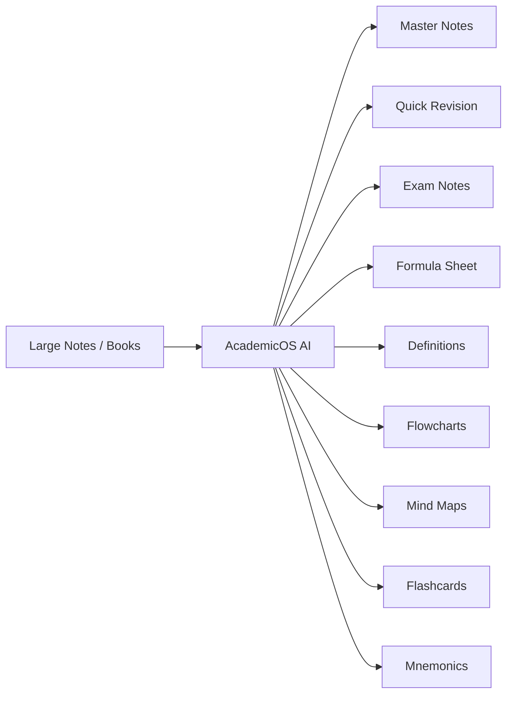
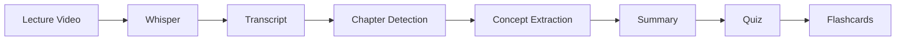
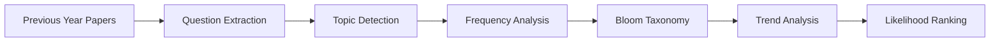
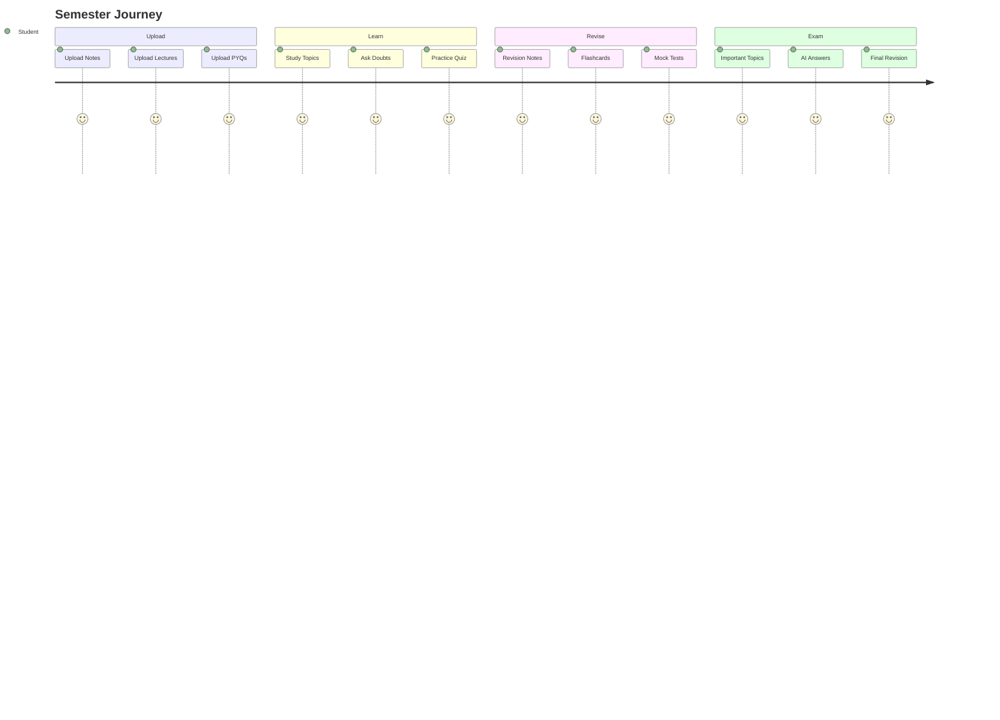
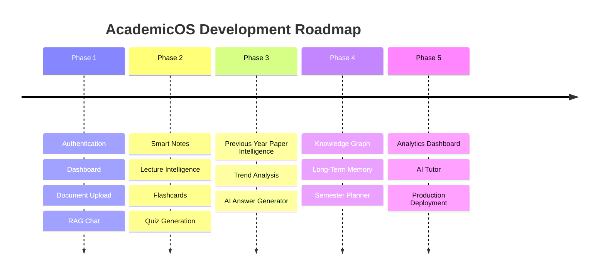

# 🎓 AcademicOS

> **An AI-Powered Academic Operating System for Personalized Learning**

AcademicOS is a next-generation AI platform that transforms notes, lectures, textbooks, previous-year papers, assignments, and personal learning history into a unified AI-powered academic workspace.

Unlike traditional AI study tools, AcademicOS combines **Multi-Agent AI**, **RAG**, **Knowledge Graphs**, **Long-Term Memory**, **Document Intelligence**, **Speech Recognition**, and **Learning Analytics** into one intelligent learning ecosystem that adapts throughout an entire semester.

---

# Demo

> 🚧 Currently Under Development

---

# Vision



---

# System Architecture



---

# Multi-Agent Workflow



---

# Smart Knowledge Base

Upload academic resources:

* Lecture Notes
* PDFs
* PPTs
* Books
* Lab Manuals
* Images
* Handwritten Notes
* Previous Year Papers
* Recorded Lectures



---

# Intelligent Note Compression

Generate multiple study formats from the same source material.



---

# Lecture Intelligence



---

# Previous Year Paper Intelligence



### Generates

* Frequently Asked Questions
* Important Topics
* Long Question Trends
* Short Question Trends
* Numerical Question Analysis
* Theory Question Analysis
* Explainable Topic Likelihood Rankings

---

# AI Answer Generator

Produces university-style answers including:

* Structured Headings
* Step-by-Step Explanations
* Equations
* Mathematical Derivations
* Circuit Diagrams
* Flowcharts
* Exam Tips
* Expected Marks
* Key Takeaways

---

# Semester Learning Journey



---

# Core Features

* Smart Knowledge Base
* AI Note Compression
* Lecture Intelligence
* Previous Year Paper Intelligence
* AI Answer Generator
* Automatic Diagram Generation
* Explainable Question Trend Analysis
* Semester Planner
* Long-Term Learning Memory
* Personalized Revision
* Interactive Analytics Dashboard
* Context-Aware Doubt Solver
* Multi-Agent AI Workflow
* Knowledge Graph-Based Learning

---

# Technology Stack

```mermaid
graph TD

Frontend["Frontend"]

Frontend --> NextJS["Next.js"]
Frontend --> Tailwind["Tailwind CSS"]
Frontend --> Framer["Framer Motion"]
Frontend --> Shadcn["shadcn/ui"]

Backend["Backend"]

Backend --> FastAPI
Backend --> LangGraph
Backend --> LangChain
Backend --> Celery
Backend --> Redis

AI["AI Models"]

AI --> GPT["OpenAI GPT-5"]
AI --> Gemini["Gemini 2.5 Pro"]
AI --> Claude["Claude (Optional)"]

Storage["Data Layer"]

Storage --> PostgreSQL
Storage --> Qdrant
Storage --> Neo4j
Storage --> S3["MinIO / Amazon S3"]

Services["AI Services"]

Services --> Whisper
Services --> PaddleOCR
Services --> Tavily
Services --> LangSmith
```



---

# Project Structure

```text
AcademicOS/

├── frontend/
│   ├── app/
│   ├── components/
│   ├── lib/
│   └── public/
│
├── backend/
│   ├── agents/
│   ├── workflows/
│   ├── rag/
│   ├── knowledge_graph/
│   ├── planner/
│   ├── analytics/
│   ├── memory/
│   ├── services/
│   ├── database/
│   └── api/
│
├── workers/
├── docker/
├── docs/
├── datasets/
└── README.md
```

---

# Development Roadmap



---

# Future Enhancements

* Mobile Application
* Collaborative Study Groups
* AI Voice Tutor
* Whiteboard Problem Solver
* Assignment Evaluation
* Research Paper Assistant
* Citation Generator
* LMS Integration
* Google Drive Integration
* Notion Integration

---

# Why AcademicOS?

AcademicOS is designed as a complete academic operating system rather than a standalone AI assistant.

It combines:

* Multi-Agent AI
* Retrieval-Augmented Generation (RAG)
* Knowledge Graphs
* Long-Term Memory
* Multimodal Document Intelligence
* Personalized Learning
* AI-Based Planning
* Explainable Exam Analytics

into a single platform that continuously learns from a student's academic journey and provides personalized support throughout an entire semester.

---

# License

MIT License

---

# Author

**Sagnick Paul**

* GitHub: https://github.com/Sagnick-Paul
* LinkedIn: https://linkedin.com/in/sagnick-paul-9aa30a352
